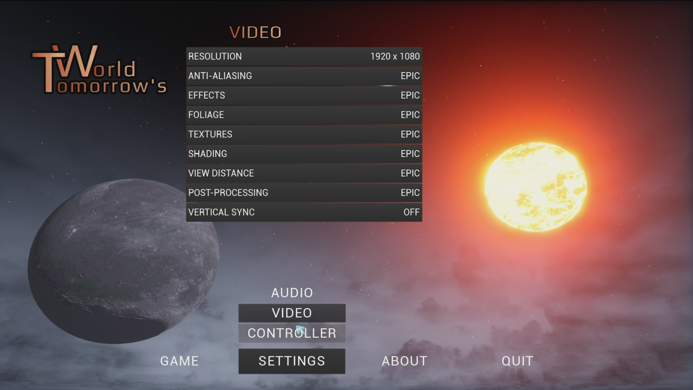
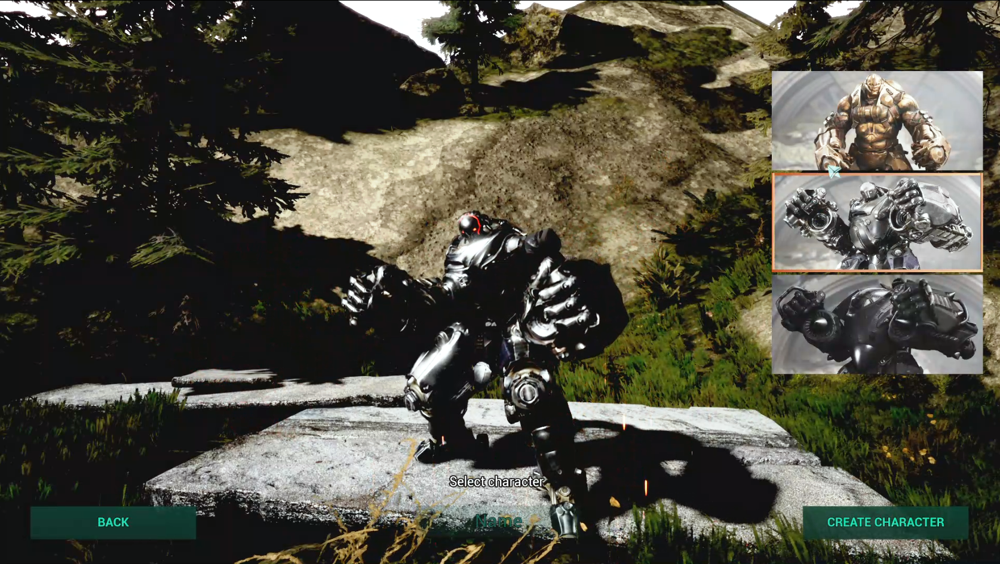
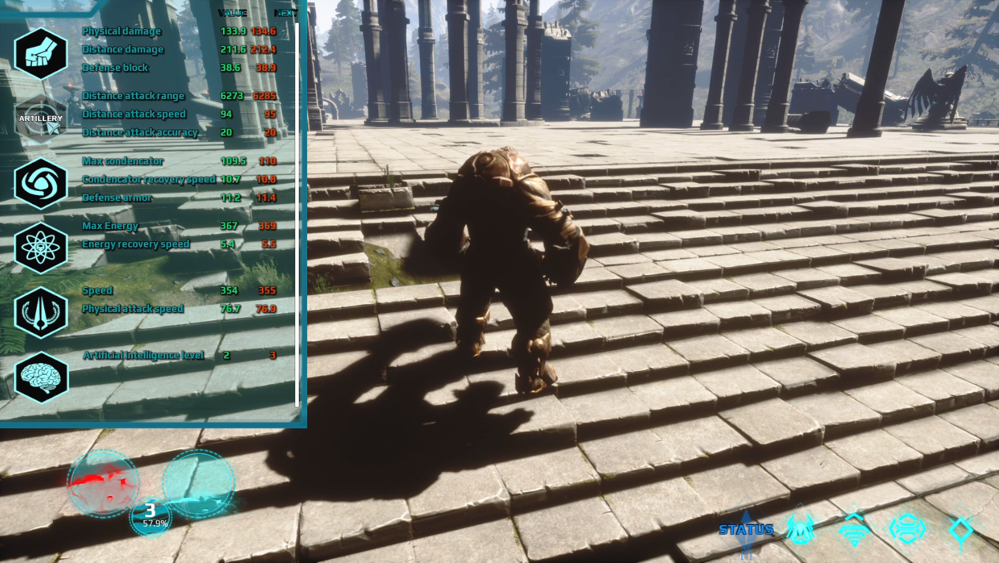
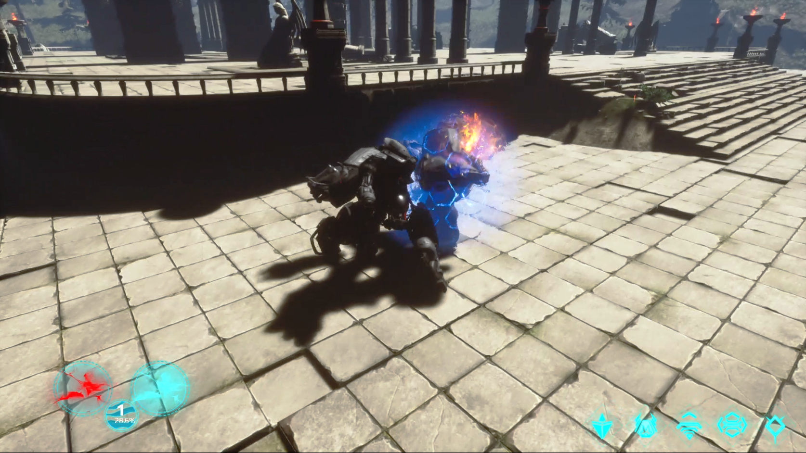

# TomorrowsWorld
Implementation of the game in a space style on Unreal Engnine 4. For a full-fledged game it is damp and requires some modifications, but it is quite capable of playing. Materials used in the project are taken from: https://www.unrealengine.com/marketplace/en-US/store.

Video demo of the game behind the link: https://www.youtube.com/watch?v=Qgd1V8tf4eE&t=1s

The game has the following features:

1. The game has single and multiplayer modes (LAN and online by IP address);
2. You can connect to the server at any time during the game when the server is turned on;
3. There are three types of characters in the game with different characteristics and individual combinations of blows;
4. Characters gain experience for killing other characters and can improve their characteristics and learn new abilities;
5. The characters have a set of shooting and double-shooting abilities, acceleration, hit amplification, and more.
6. There is an arena in the world for a joint fun game;
7. All controls are listed in the game settings menu;

Demonstration of the game:

